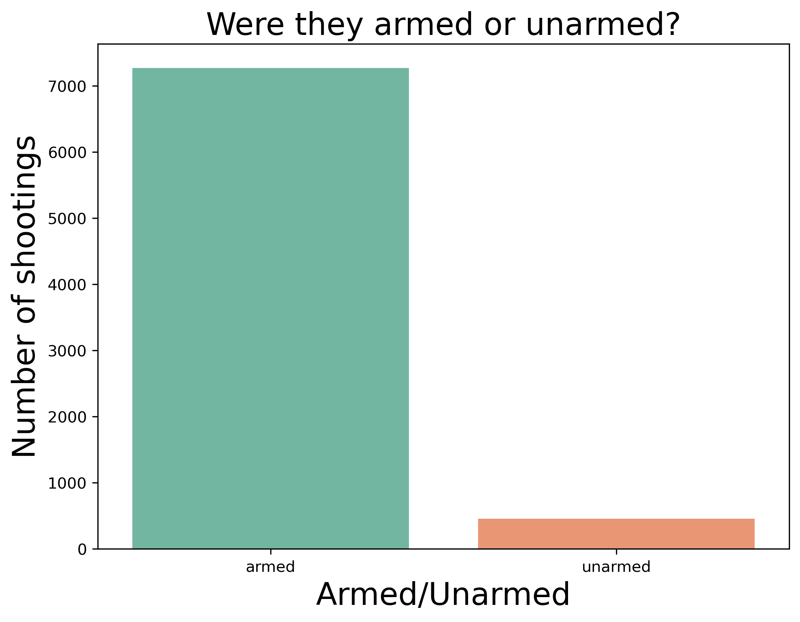
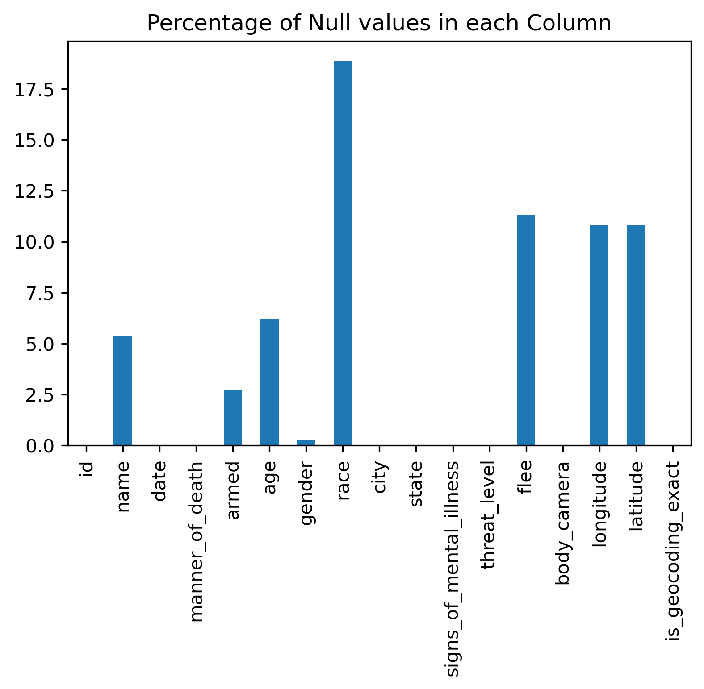
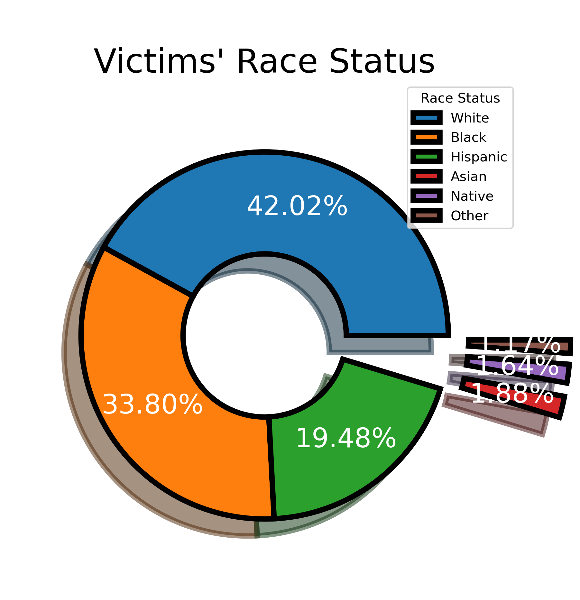
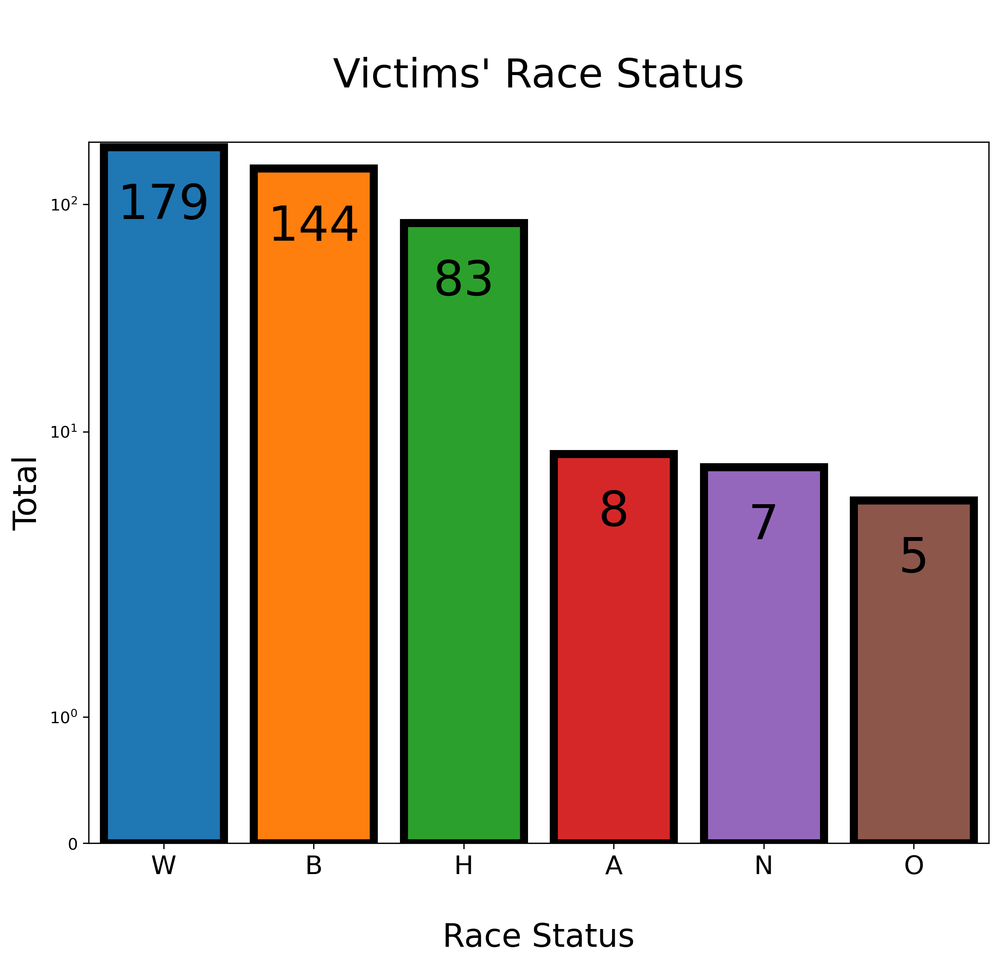
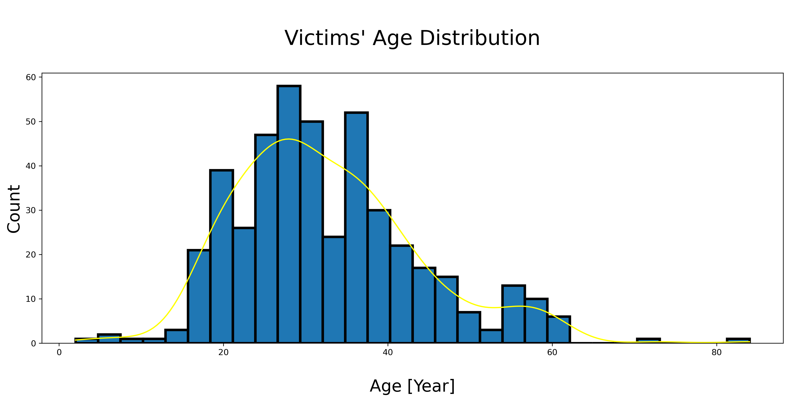

# Introduction 

Our dataset consists of people killed by law enforcement in the United States, both on duty and off duty. Although Congress instructed the Attorney General in 1994 to compile and publish annual statistics on police use of excessive force, this was never carried out, and the Federal Bureau of Investigation does not collect these data. Therefore, we believe that it is crucial to examine this dataset and explore it to find any inconsistencies with the way the law enforcement uses its power. This helps maiantain transparency within the country and accounts for the actions of the law enforcement. 

In this project, we will we exploring three research questions:
1. Are there any trends between the race & age of the victim and the number of shootings by law enforcement in the United States? 
1. Trends in shooting for people belonging to marginalized communities, example women, people of colour, people with mental issues, people belonging to older age groups. 
1. Sahraj Research Question

----
# Exploratory Data Analysis (EDA)

I will first find out how kany unarmed victims are present in the datatset since I will be focusing on these victims to answer my research question.

 

Since, this dataset is based on real time events, we expected it to have few null values however, we would not be able to analyse these values. In the above image, you can see the number of null values in each column and therefore, we decided to remove all null values from the dataset. 

----
# Data Analysis

## **Research Question 1:** 
### **Are there any trends between the race & age of the unarmed victim and the number of shootings by law enforcement in the United States? (Manav)**

 

To explore my research question, we would only focus on unarmed victims therefore, I have used a dataset with only victims that were unarmed. First, we would explore the percentage of unarmed victims of each race. To do this I will plot a pie graph which depicts percentages of each race, as seen below.

We would also graph a countplot that depcicts the number of shootings of unarmed victims of each race. 

With the above visualizations, we can observe that White people have been killed the most followed by Black and Hispanics. Even though, this seems to be coinciding with the population of the country, we can see that 33.80% of the unarmed victims were black even though there are only around 12% of black population in the United States. These could possibly imply some form of racism in the law enforcment of the country. 

We would know look intk the age of the unarmed victims. We will plot a histogram to depict the distribution of age of the unarmed victims. 

With the above histogram, we can observe that most of the victims are aged between 20-40 years of age. The kde (yellow plotted line) also shows that the distribution of the age between 20-40 years of age as well. This is very believable since generally people between the age of 20-40 years usually commit crimes. 

## Research Question 2:
### **Trends in shooting for people belonging to marginalized communities, example women, people of colour, people with mental issues, people belonging to older age groups.? (Sahil)**
 

To explore my research question, I used various kinds of visualizations to see trends in various scenarious during the shootings. 
.png)

 
When looking at marginalized communities I looked at people of colour, people who are too young or old, and people who are not mentally well. 
There were approximately 2000 cases in which someone who was not mentally well was involved. When looking at the graph of mentall-ill plus race vs count, the people belonging to hispanic and black communities has the highest counts after white people, even though their population sizes were quite different. After that coming to the graph which compares the gender, bases on counts of shooting, females were involved in a lot less cases than men. 
Lastly when we look at marginalized communities, we looked at the age vs counts of shooting graph from which we can draw out the conclusion that children an elderely were involved in barely any counts of shooting , whereas people belonging to the range of 20 to late 40 had the most counts.

.png)

.png)
## RQ 3:

# Conclusion

